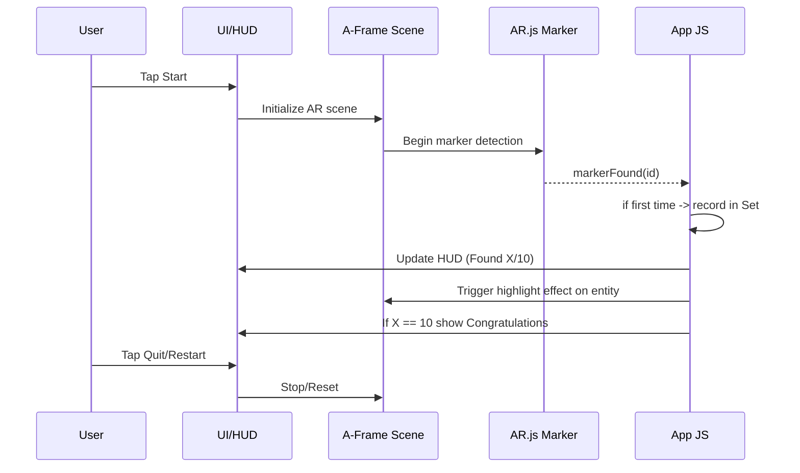

# ARHunt — Implementation Plan

This plan targets a fast, reliable v1 using A-Frame + AR.js pattern markers, deployed via GitHub Pages. It includes the project structure, step-by-step tasks, testing, and deployment. It also outlines an optional path to natural-image tracking (mind-ar-js) if you decide to move beyond pattern markers later.

## Architecture & Tech Choices
- Framework/Engine: A-Frame (Three.js on top) via CDN.
- Marker tracking: AR.js (pattern markers, .patt files) for robust detection of simple, printable symbols.
- Content: 2D planes (a-plane) textured with PNG overlays to simulate framed pictures on walls.
- Hosting: GitHub Pages, HTTPS by default.
- No build step initially; pure static site.

Why AR.js for v1?
- Pattern markers are dependable for simple “shape” targets (triangle, square, etc.).
- Runs in iOS Safari and Android Chrome without WebXR dependencies.
- Quick to ship: all CDN-based, no bundlers.

Future option (not for v1): mind-ar-js
- Pros: Natural image targets (no black border markers).
- Cons: Simple geometric shapes track poorly; requires texture-rich images; more tuning.

## User Flow (Mermaid)
```mermaid
flowchart TD
  A[Start Menu] -->|Tap Start| B[Request Camera Permission]
  B -->|Granted| C[AR Scanning View]
  B -->|Denied| A
  C --> D{Symbol Detected?}
  D -->|No| C
  D -->|Yes (new)| E[Highlight + Show Overlay]
  E --> F[Update HUD Found X/10]
  F -->|X < 10| C
  F -->|X == 10| G[Congratulations Screen]
  G -->|Restart| C
  G -->|Quit| A
  C -->|Quit| A
```

## Component Interaction (Mermaid)


## File/Folder Structure
- index.html (A-Frame scene + menu/HUD containers)
- styles.css (mobile-first, fun theme, HUD, border, overlays)
- script.js (marker events, HUD updates, menu/quit logic)
- assets/
  - patterns/ (10 .patt marker files)
  - overlays/ (10 PNGs used as flat picture textures)
  - markers/ (printable images/PDFs of each marker)
- requirements.md, plan.md
- MEMORY.MD (running log of changes)

## Tasks & Steps

1) Initialize docs and structure
- Create requirements.md (already added) and plan.md (this file).
- Create MEMORY.MD and log decisions.

2) Create basic scaffolding
- index.html: Include A-Frame and AR.js via CDN, define a-scene, camera, HUD/menu overlays, and placeholder a-marker entities for all 10 symbols.
- styles.css: Theme, border, HUD position, button styles, congrats overlay.
- script.js: 
  - Maintain Set of found IDs and total count.
  - Listen to markerFound/markerLost (emitevents="true" on a-marker).
  - On first-time detection: flash/highlight + update HUD.
  - Show Congratulations when 10/10; handle Quit/Restart.

3) Generate marker patterns (.patt)
- Use the AR.js Marker Generator to create 10 pattern files for: triangle, square, rectangle, circle, star, pentagon, hexagon, diamond, heart, arrow.
- Save them as:
  - assets/patterns/triangle.patt
  - assets/patterns/square.patt
  - assets/patterns/rectangle.patt
  - assets/patterns/circle.patt
  - assets/patterns/star.patt
  - assets/patterns/pentagon.patt
  - assets/patterns/hexagon.patt
  - assets/patterns/diamond.patt
  - assets/patterns/heart.patt
  - assets/patterns/arrow.patt
- Also export the corresponding printable marker images into assets/markers/ for placing on walls.

Marker tips:
- Use high-contrast black-on-white shapes centered within the marker frame.
- Ensure print size at least ~7–10 cm per marker for reliable detection.
- Avoid glossy paper to reduce reflections.

4) Prepare overlay images
- Place 10 PNG overlays under assets/overlays/{shape}.png.
- Start simple (e.g., themed frames or stickers). Keep each under ~200KB.

5) Wire markers to overlays
- For each a-marker (id="triangle", type="pattern", url="assets/patterns/triangle.patt", emitevents="true"), add an a-plane child:
  - rotation="-90 0 0" to lay flat in marker plane.
  - width/height tuned to marker scale (start with 1 x 1, adjust visually).
  - material="src: #triangleTexture" or set via script.
- Optionally add a subtle easing/flash animation on first detection.

6) HUD, Menu, and Congrats UI
- Menu overlay with Start + short instructions.
- HUD top-right: “Found X/10”.
- Minimal border around the camera view (CSS box-shadow or border on container).
- Quit button visible in scan view (top-left/right) returning to Menu and resetting state.
- Congrats overlay with Restart.

7) Testing
- On Android Chrome, local dev can work over http(s); on iOS Safari, camera requires HTTPS.
- Recommended test path: push to GitHub Pages and test directly on phone.
- Lighting: try ambient indoor and directional lamp; avoid direct glare.

8) Deployment (GitHub Pages)
- Serve from main branch root. After pushing, enable Pages in repo settings.
- The Pages URL becomes the primary share link.

9) Admin Page (Calibration)
- Page: /admin.html with live AR view and the same 10 markers.
- Controls: overlay selection, width/height, position (x,y,z), rotation (x,y,z).
- Load existing config.json and apply it live.
- Download updated config.json; commit it to assets/config.json for the main app to consume at runtime.
- Use this to make overlays look correctly sized/oriented against real-world fixtures (e.g., a picture frame).

## Pseudocode / Snippets (for reference)

HTML scene skeleton (A-Frame + AR.js via CDN):

```
<!DOCTYPE html>
<html>
<head>
  <meta name="viewport" content="width=device-width, initial-scale=1" />
  <title>ARHunt</title>
  <link rel="stylesheet" href="./styles.css" />
  <script src="https://aframe.io/releases/1.4.2/aframe.min.js"></script>
  <script src="https://cdn.jsdelivr.net/gh/AR-js-org/AR.js@3.4.5/aframe/build/aframe-ar.js"></script>
</head>
<body>
  <div id="menu" class="overlay">
    <h1>ARHunt</h1>
    <p>Find 10 hidden symbols around the room. Move your phone to scan the walls!</p>
    <button id="startBtn">Start</button>
  </div>

  <div id="hud" class="overlay hidden">
    <div class="stats">Found <span id="foundCount">0</span>/10</div>
    <button id="quitBtn" class="ghost">Quit</button>
  </div>

  <div id="congrats" class="overlay hidden">
    <h2>Congratulations!</h2>
    <p>You found them all.</p>
    <button id="restartBtn">Play Again</button>
  </div>

  <a-scene embedded vr-mode-ui="enabled: false" renderer="logarithmicDepthBuffer: true" arjs="sourceType: webcam; debugUIEnabled: false;">
    <!-- Camera -->
    <a-entity camera></a-entity>

    <!-- Example marker: repeat for 10 shapes -->
    <a-marker id="triangle" type="pattern" url="assets/patterns/triangle.patt" emitevents="true">
      <a-plane id="trianglePlane" position="0 0 0" rotation="-90 0 0" width="1" height="1" material="src: #triangleTex; transparent: true;"></a-plane>
    </a-marker>

    <!-- Define image assets (can also set via script) -->
    <a-assets>
      
      <!-- Add other 9 overlays -->
    </a-assets>
  </a-scene>

  <script src="./script.js"></script>
</body>
</html>
```

JS event handling outline:

```
const found = new Set();
const total = 10;

function updateHUD() {
  document.getElementById('foundCount').textContent = String(found.size);
}

function showCongrats() {
  document.getElementById('congrats').classList.remove('hidden');
}

function resetGame() {
  found.clear();
  updateHUD();
  // hide overlays if needed, reset UI states
}

window.addEventListener('load', () => {
  const markers = document.querySelectorAll('a-marker');
  markers.forEach(m => {
    m.addEventListener('markerFound', () => {
      const id = m.id;
      if (!found.has(id)) {
        found.add(id);
        updateHUD();
        // flash/highlight logic here
        if (found.size === total) showCongrats();
      }
    });
  });

  document.getElementById('startBtn').addEventListener('click', () => {
    document.getElementById('menu').classList.add('hidden');
    document.getElementById('hud').classList.remove('hidden');
  });

  document.getElementById('quitBtn').addEventListener('click', () => {
    resetGame();
    document.getElementById('hud').classList.add('hidden');
    document.getElementById('congrats').classList.add('hidden');
    document.getElementById('menu').classList.remove('hidden');
  });

  document.getElementById('restartBtn').addEventListener('click', () => {
    resetGame();
    document.getElementById('congrats').classList.add('hidden');
  });
});
```

CSS ideas (mobile-first):
- Fullscreen overlays with position: fixed.
- Minimal border around the scene container (e.g., body: border: 6px solid #ffc107;).
- Large buttons (min-height ~44px).

## Local Development
- For Android Chrome, you can often test locally using a simple static server (`npx http-server`).
- For iOS Safari, camera requires HTTPS. Recommended: push to GitHub Pages and test the published URL on your phone.
- Alternatively, set up a local HTTPS dev server (mkcert + http-server -S), but pushing to Pages is simpler.

## Deployment (GitHub Pages)
1. Commit and push all files to main.
2. In GitHub repo Settings → Pages → Set Source = Deploy from a branch → Branch = main, folder = / (root).
3. Wait for Pages build and open the published URL on your phone.

## Testing Checklist (Acceptance)
- Start menu loads with instructions and Start button.
- Camera permission prompt appears on Start.
- Present each printed marker; verify overlay appears, highlight flashes, counter increments once per marker.
- Quit returns to menu; Restart from congrats resets counter to 0.
- Works on iOS Safari and Android Chrome over HTTPS.
- Admin: Marker is selectable on detection; UI fields change live size/offset/rotation of the overlay; Downloaded config.json, when placed at assets/config.json, updates the main app overlays after a refresh.

## Time & Risk Notes
- v1 (docs + scaffolding + markers + overlays): 0.5–1.5 days depending on asset prep.
- Main risk: Marker print quality and lighting. Mitigate with high-contrast prints and even lighting.

## Copy-paste Commands (setup; do not run blindly)
```
# from repo root
mkdir -p assets/patterns assets/overlays assets/markers
# create files (if not already created)
:> index.html
:> styles.css
:> script.js
# add your content to files, then commit
git add .
git commit -m "feat: scaffold ARHunt (A-Frame + AR.js), docs, and assets structure"
git push origin main
```

## References
- AR.js (A-Frame): https://ar-js-org.github.io/AR.js-Docs/
- Pattern Marker Generator: https://jeromeetienne.github.io/AR.js/three.js/examples/marker-training/examples/generator.html
- A-Frame Docs: https://aframe.io/docs/
- GitHub Pages: https://docs.github.com/pages
- mind-ar-js (for future natural image tracking): https://hiukim.github.io/mind-ar-js-doc/

